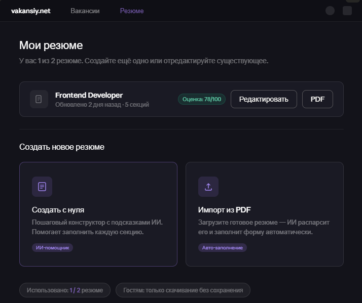
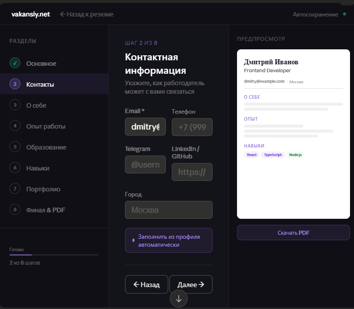
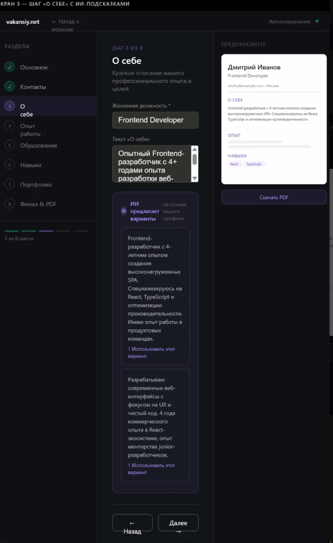
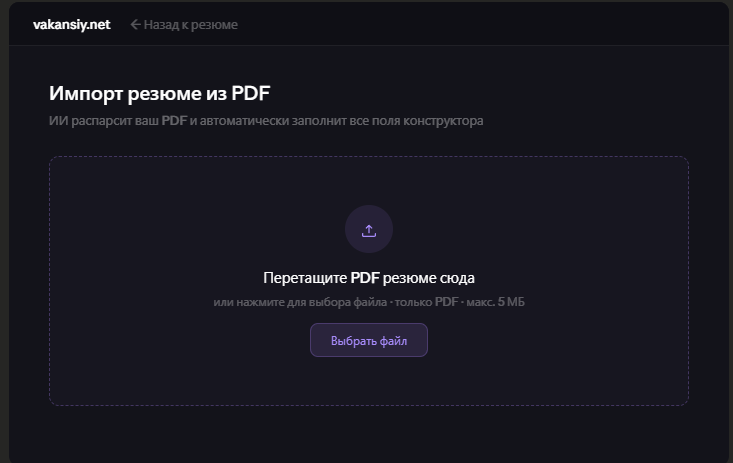
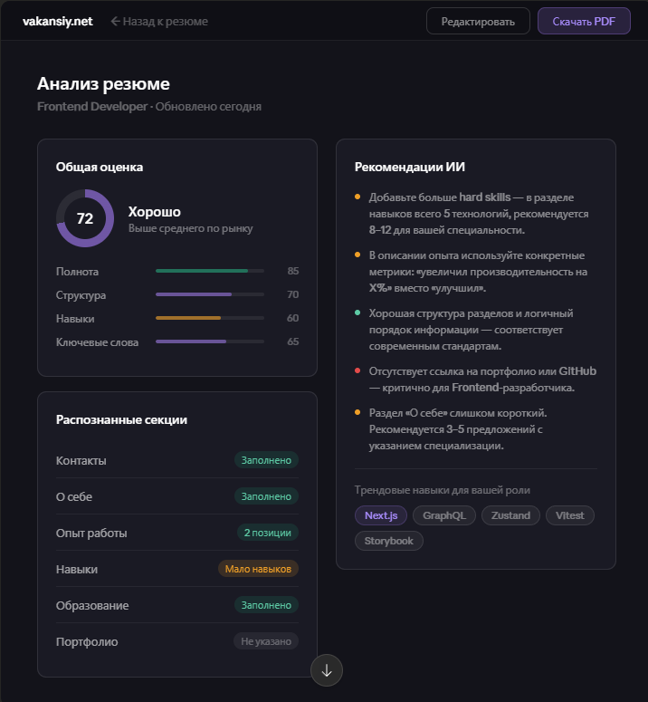

# Resume Module — Screens

> Дизайн: тёмная тема (#13131a фон, #0f0f15 сайдбар/шапка), акцент #a78bfa (purple),
> успех #5DCAA5 (teal), предупреждение #ef9f27 (amber), ошибка #e24b4a.
> Компоненты: shadcn/ui + Tailwind. Стиль — как в существующих страницах /vacancies и /profile.

---

## Screen 1: /resume — Список резюме



**Layout:** страница с хедером (как на /vacancies)

**Секция «Мои резюме»:**

- Заголовок h1 «Мои резюме»
- Подзаголовок: «У вас X из 2 резюме. [CTA]»
- Список карточек резюме (ResumeCard):
    - Иконка документа
    - Название резюме + желаемая должность
    - Мета: «Обновлено N дней назад · X секций»
    - Бейдж оценки (если есть анализ): «Оценка: 78/100» — зелёный
    - Кнопки: «Редактировать» (primary), «PDF» (secondary), «Удалить» (ghost/danger)

**Секция «Создать новое»** (видна только если < 2 резюме):

- 2 карточки-выбора в сетке:
    - «Создать с нуля» — иконка документа, бейдж «ИИ-помощник»
    - «Импорт из PDF» — иконка загрузки, бейдж «Авто-заполнение»
- Пилюля-лимит: «Использовано: X / 2 резюме»

**Для гостя:** баннер «Попробуйте резюме-билдер без регистрации» + кнопка «Попробовать»

---

## Screen 2: /resume/builder/[id] — Конструктор, шаг «Контакты»



**Layout:** 3 колонки — сайдбар (220px) / форма (flex-1) / предпросмотр (260px)

**Хедер:** «← Назад к резюме» + зелёная точка «Автосохранение»

**Левая панель (степпер):**

- 8 шагов: done (✓ зелёный), active (фиолетовый), pending (серый)
- Прогресс-бар: «X из 8 шагов»

**Шаги:**

1. Основное — ФИО, желаемая должность, фото (опционально)
2. Контакты — email\*, телефон, город, telegram, linkedin/github + кнопка «Заполнить из профиля»
3. О себе — textarea + AiSuggestionPanel
4. Опыт работы — список позиций: компания, должность, период, описание + ИИ для описания
5. Образование — учреждение, степень, специальность, годы
6. Навыки — Hard skills + Soft skills (теги) + трендовые навыки от ИИ
7. Портфолио — список: название, URL, описание
8. Финал — предпросмотр + запуск анализа + «Опубликовать» / «Скачать PDF»

**Правая панель:** мини-предпросмотр PDF (realtime обновление) + кнопка «Скачать PDF»

---

## Screen 3: /resume/builder/[id] — Шаг «О себе» с ИИ



**AiSuggestionPanel:**

- Заголовок «ИИ предлагает варианты» + «на основе вашего профиля» (muted, справа)
- 2 карточки с вариантами текста
- Под каждой кнопка «↑ Использовать этот вариант»
- Счётчик оставшихся запросов (напр. «2 из 3 запросов»)

---

## Screen 4: /resume/import — Импорт PDF



**Drag-and-drop зона:**

- Пунктирная фиолетовая рамка
- «Перетащите PDF резюме сюда»
- «только PDF · макс. 5 МБ»
- Кнопка «Выбрать файл»

**После загрузки:** имя файла + прогресс-бар → лоадер «Анализируем резюме...» (5–15 сек)

---

## Screen 5: /resume/[id]/analysis — Аналитика



**Layout:** 2 колонки

**Левая:**

- Кольцо-скор с числом в центре + уровень («Хорошо», «Отлично» и т.д.)
- 4 прогресс-бара: Полнота, Структура, Навыки, Ключевые слова
- Список секций со статусами: зелёный / жёлтый / серый

**Правая:**

- Рекомендации с точками-приоритетами: красная = критично, жёлтая = улучшить, зелёная = ок
- Трендовые навыки: фиолетовые = уже есть, серые = добавить (клик → добавляет в резюме)

---

## Компоненты

### ResumeCard

```ts
Props: resume (Resume & { analysis?: ResumeAnalysis }), onEdit, onDelete, onExportPdf
```

### ResumeStepper

```ts
Props: currentStep: number, steps: Step[], completedSteps: number[], onStepClick: (n: number) => void
```

### ResumePreview

```ts
Props: sections: ResumeSection[]
// Realtime мини PDF-шаблон
```

### AiSuggestionPanel

```ts
Props: sectionType: ResumeSectionType, context: { desired_position: string, sections: ResumeSection[] }, onSelect: (text: string) => void
State: suggestions: string[], isLoading: boolean, requestsLeft: number
```

### AnalysisScore

```ts
Props: analysis: ResumeAnalysis;
// Кольцо-скор + прогресс-бары
```
